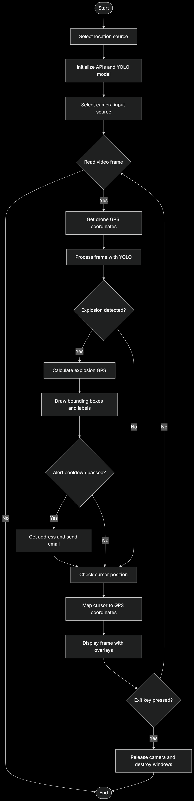



# Military-based Missile Impact Detection System


## Overview

This project is a real-time missile/explosion impact detection system using computer vision (YOLO), GPS/geolocation, and automated alerting. It is designed for military or security applications to detect explosions or missile impacts from a video feed (e.g., drone or surveillance camera), estimate the impact location, and send immediate alerts with coordinates and map links.

## Features

- Real-time explosion detection using a YOLOv3 deep learning model
- Supports both physical and virtual (OBS) camera input
- Retrieves location via drone GPS or PC IP-based geolocation
- Calculates and displays estimated impact coordinates on video
- Maps cursor position to GPS coordinates for analysis
- Sends automated email alerts with Google Maps links and address
- Cooldown system to avoid alert spamming

## How It Works

1. **Camera Input:** User selects a physical or virtual camera as the video source.
2. **Location Source:** User chooses between drone GPS or PC IP-based geolocation.
3. **Detection:** Each frame is processed by YOLOv3 to detect explosions.
4. **Coordinate Calculation:** When an explosion is detected, the system estimates the impact's GPS coordinates based on the detection's position in the frame, camera FOV, and current location.
5. **Alerting:** If a new event is detected (with cooldown), an email is sent with the estimated coordinates, address, and a Google Maps link.
6. **Visualization:** The video feed displays detection boxes, GPS info, and allows mapping cursor position to GPS for further analysis.

## Project Structure

```
Military-based-Missile-Impact-Detec-on-System/
├── impact_system/
│   ├── __init__.py
│   ├── app.py                            # Main runtime loop and orchestration
│   ├── config.py                         # Central configuration
│   ├── detector.py                       # YOLO model loading and detection
│   ├── gps_service.py                    # GPS/geolocation and coordinate utilities
│   ├── alert_service.py                  # Email alert delivery
│   └── cursor_mapper.py                  # Cursor-to-GPS mapping logic
├── yolo_impact_detection(zen 421.3).py   # Entrypoint script
├── yolov3_testing.cfg                    # YOLOv3 config file
├── yolov3_testing - Copy.cfg             # Backup/alternate config
├── requirements.txt                      # Python dependencies
├── project-architecture.png              # System flow diagram
└── README.md                             # Project documentation
```

## Requirements

- Python 3.7+
- OpenCV (`cv2`)
- NumPy
- geopy
- googlemaps
- requests
- smtplib (standard library)
- A trained YOLOv3 weights file and config (update paths in the script)

Install dependencies with:
```
pip install -r requirements.txt
```

## Setup & Usage

1. **Edit the script:**
	- Set your Google Maps API key in `GOOGLE_MAPS_API_KEY`.
	- Set your email credentials for SMTP (use an app password for Gmail).
	- Optionally set `YOLO_CFG_PATH` and `YOLO_WEIGHTS_PATH` environment variables.
	- You can also adjust runtime constants in `impact_system/config.py`.

2. **Run the script:**
    ```
    python "yolo_impact_detection(zen 421.3).py"
    ```
    - Follow prompts to select camera and location source.

3. **Operation:**
	- The video window will show real-time detection.
	- Detected explosions are marked with bounding boxes and estimated coordinates.
	- Alerts are sent via email with location details and a Google Maps link.
	- Move the mouse over the video to see mapped GPS coordinates for any point.
	- Press `q` or `ESC` to exit.

## Main Components Explained

- **YOLOv3 Detection:** Uses a pre-trained model to detect explosions in video frames.
- **GPS/Geolocation:** Gets current location from drone GPS or via Google Geolocation API (IP-based).
- **Impact Localization:** Calculates the real-world coordinates of detected impacts using camera FOV and detection position.
- **Email Alerts:** Sends formatted alerts with coordinates, address, and map link to a configured recipient.
- **Cursor Mapping:** Maps mouse position on the video to GPS coordinates for further analysis.

## Notes

- Ensure your Google Maps API key and email credentials are valid.
- The system is designed for demonstration and research; adapt for production use as needed.
- Cooldown period prevents alert spamming (default: 60 seconds).


## License

This project is for research and demonstration purposes. Add a license if you intend to share or deploy publicly.

---


